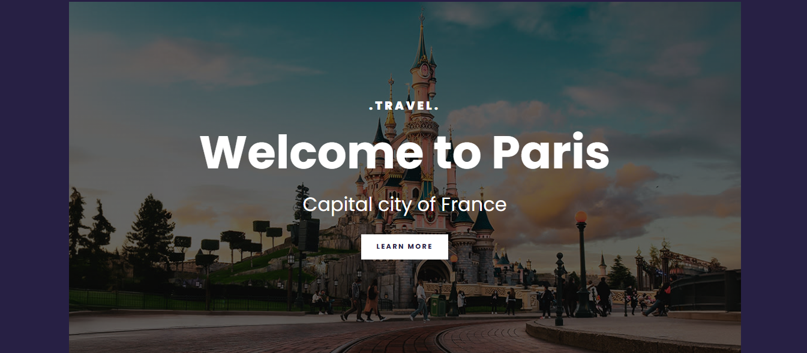
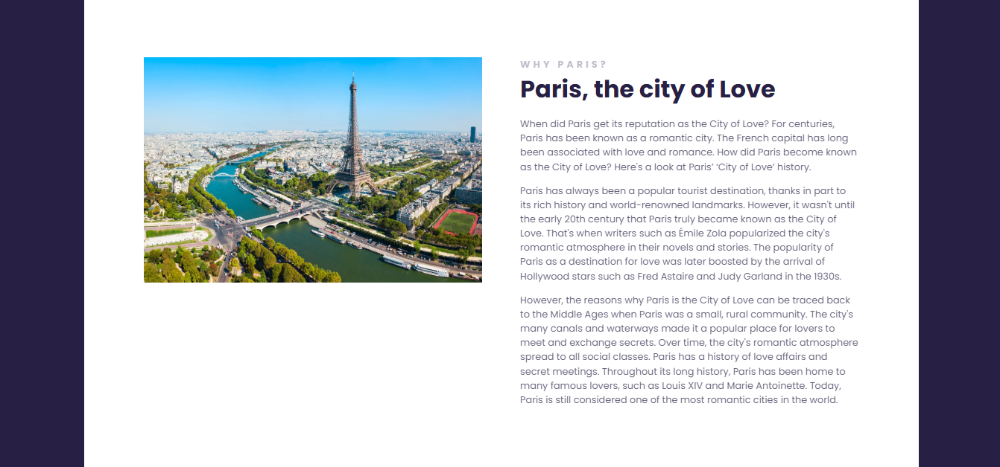
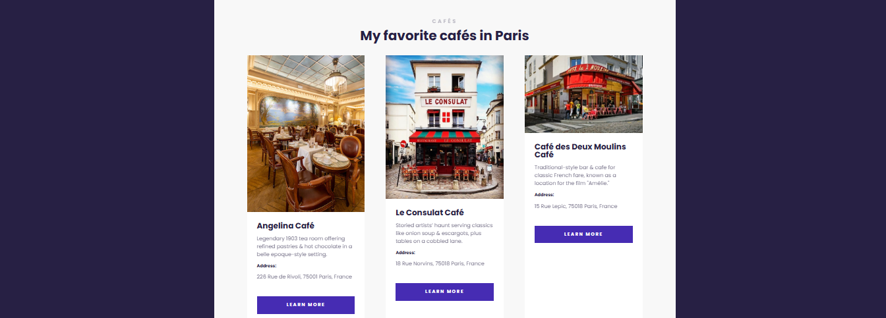
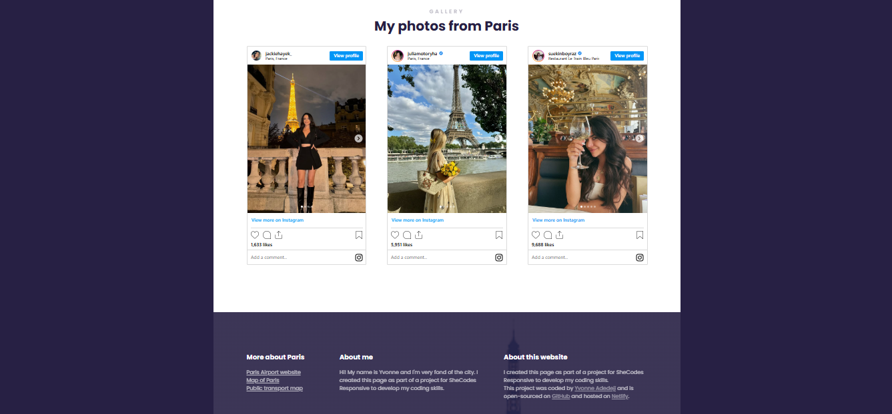

# responsive-travel-project

## 📌 Description
This project is a travel website dedicated to the city of Paris, highlighting its reputation as the "City of Love." It includes information about Paris, its famous landmarks and the best cafés to visit while exploring the city. The site features a clean, modern design with an easy-to-navigate layout, making it an ideal resource for travelers and lovers of Parisian culture. This project also showcases images from Paris, embedded directly from Instagram. The gallery is designed with a clean and responsive layout to display multiple images beautifully.

## 🛠 Prerequisites
N/A

## 📋 Criteria
* Modern and responsive design for multiple screen sizes.
* Information about Paris as a city of love.
* Presentation of some iconic cafés in Paris.
* Usage of Google Fonts and custom styles for a better visual experience.
* Embed images directly from Instagram
* Minimal external dependencies

 ## 💻 Technologies Used
The application is built with the following technologies:
* HTML
* CSS
* Google Fonts
* JavaScript (for Instagram embed functionality)

## 🚀 Installation
No installation is required to use the app. It is hosted online and can be accessed via a web browser.

## 📚 Usage
1. Open the web application in your browser.
2. Explore the information about Paris and its romantic history.
3. Browse through the café section to discover popular Parisian cafés.
4. Click on the "Learn more" links to view additional details about each café.

## 🔗 Live Demo & Repository
Application can be viewed here: 
* [Live](https://ya-responsive-travel-project.netlify.app/)

* [Repository](https://github.com/yvonnesarah/responsive-travel-project)

## 🖼 Screenshot(S)
Below is a preview of Travel

Travel to Paris

Paris Cafes

Paris Gallery

## 👥 Credit
Instagram API for embedding photos

## 📜 License
This project is open-source. For licensing details, please refer to the LICENSE file in the repository.

## 📬 Contact
You can reach me at 📧 yvonneadedeji.sarah@gmail.com.
